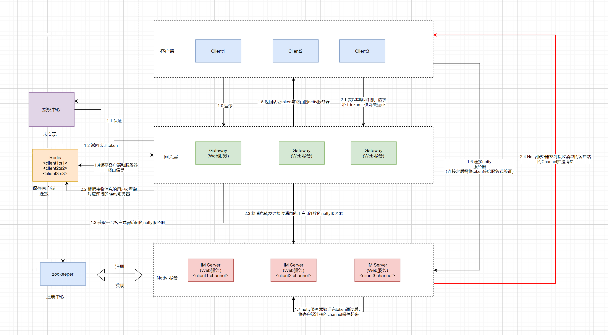

## 介绍

`(TIM)` 一款 `IM(即时通讯)`系统；同时提供了一些组件帮助开发者构建一款属于自己可水平扩展的 `IM` 。

借助 `TIM` 可以实现以下需求：

- `IM` 即时通讯系统。
- 适用于 `APP` 的消息推送中间件。

## 系统架构

[//]: # (![]&#40;http://assets.processon.com/chart_image/611bb33a1efad412479f7157.png&#41;)
[//]: # (![]&#40;static/architecture.png&#41;)
  

- `TIM` 中的各个组件均采用 `SpringBoot` 构建。
- 采用 `Netty` 构建底层通信。
- `Redis` 存放各个客户端的路由信息、账号信息、在线状态等。
- `Zookeeper` 用于 `IM-server` 服务的注册与发现。
- 认证这块逻辑尚没有实现

### tim-server

`IM` 服务端；用于接收 `client` 连接、消息透传、消息推送等功能。

**支持集群部署。**

### tim-gateway

消息路由网关；用于处理消息路由、消息转发、用户登录、用户下线以及一些运营工具（获取在线用户数等）。

### tim-client

`IM` 客户端；给用户使用的消息终端，一个命令即可启动并向其他人发起通讯（群聊、私聊）。

## 流程图

[//]: # (![]&#40;http://assets.processon.com/chart_image/611bb33a1efad412479f7157.png&#41;)

- 客户端向 `gateway` 发起登录。
- 登录成功从 `Zookeeper` 中选择可用 `IM-server` 返回给客户端，并保存登录、路由信息到 `Redis`。
- 客户端向 `IM-server` 发起长连接，成功后保持心跳。
- 客户端下线时通过 `gateway` 清除状态信息。

## 快速启动

首先需要安装 `Zookeeper、Redis` 并保证网络通畅。

### 部署 IM-server(tim-server)

直接运行TIMServerApplication.java

### 部署网关服务器(tim-gateway)

直接运行GatewayApplication.java
> tim-gateway 本身就是无状态，可以部署多台；使用 Nginx 代理即可。

### 启动客户端(tim-client)

直接运行TIMClientApplication.java

### 接口

#### 注册账号

```shell
curl -X POST --header 'Content-Type: application/json' --header 'Accept: application/json' -d '{
  "reqNo": "13766668890",
  "timeStamp": 0,
  "userName": "wangwu"
}' 'http://路由服务器:8090/registerAccount'
```

从返回结果中获取 `userId`,写入客户端项目tim-client的配置文件里

```json
{
  "code": "9000",
  "message": "成功",
  "reqNo": null,
  "dataBody": {
    "userId": 1633614560039,
    "userName": "wangwu"
  }
}
```

